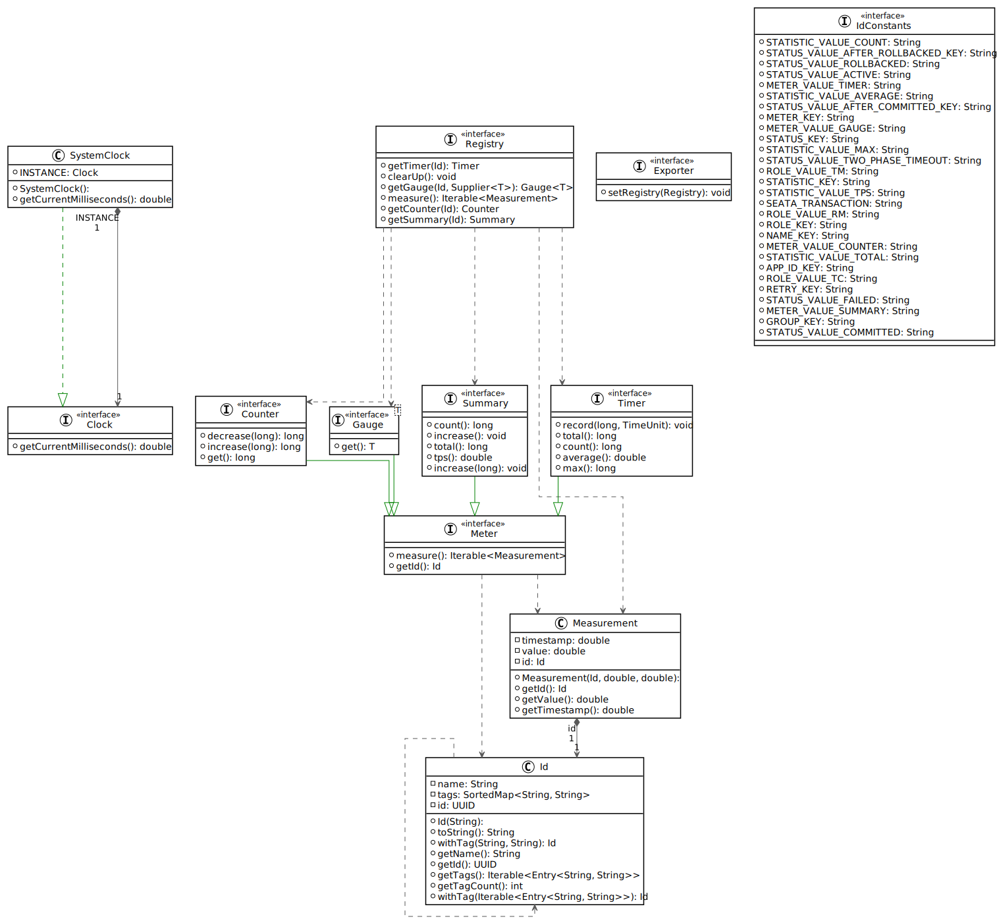
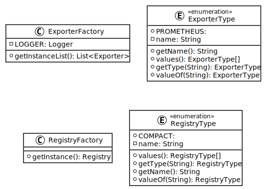
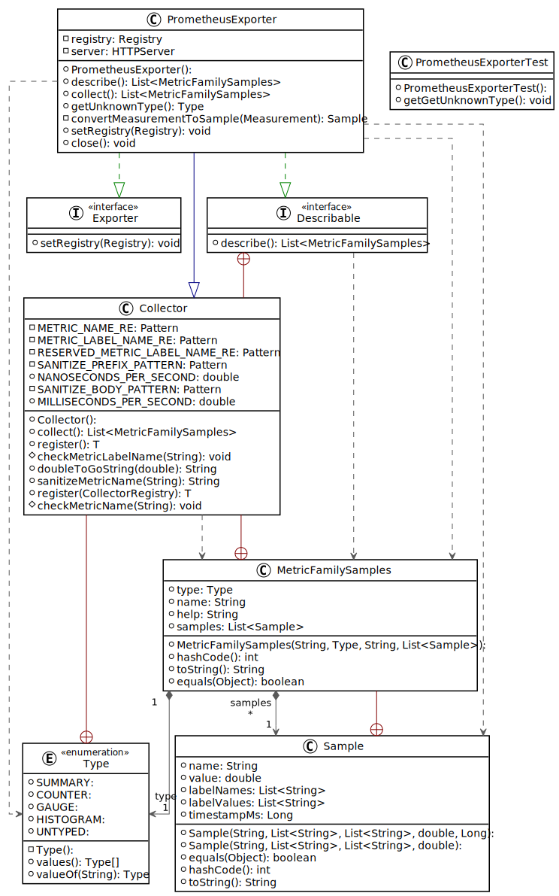
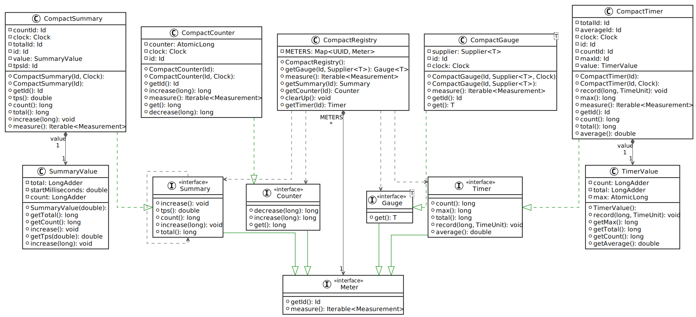
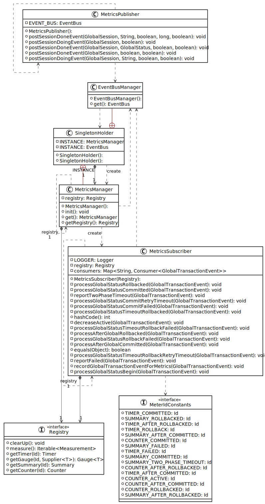
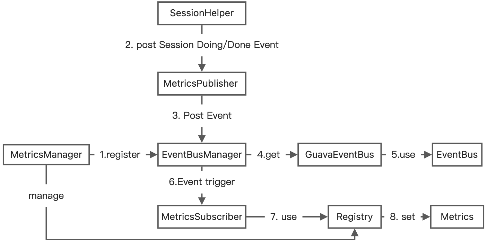
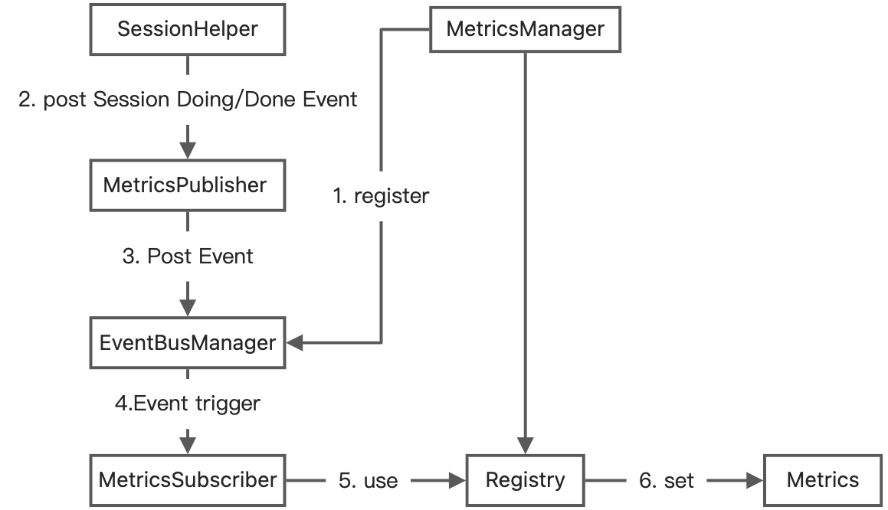

<center><b><font size=6 face="黑体">项目申请书</font></b></center>
<center><b><font size=5 face="黑体">项目名称:Seata Client SDK侧的metrics统计</font></b></center>
<center><b><font size=5 face="黑体">项目主导师:刘洋</font></b></center>
<center><b><font size=5 face="黑体">申请人:刘戎</font></b></center>
<center><b><font size=3 face="黑体">日期:2022.06.23</font></b></center>
<center><b><font size=3 face="黑体">邮箱:767817253@qq.com</font></b></center>

# 1. 项目背景

## 1.1 需求描述
metrics统计有助于帮助使用对Seata的执行过程进行有效的监控，帮助发现可能存在的问题。

## 1.2 任务

1. 客户端SDK侧的主要监控指标包括：Global begin/commit/rollback， Branch registry/flush undolog/report/commit/rollback等状态统计。
2. 另外，对undolog，fence等hook的调用也要做metrics统计。

## 1.3 Seata介绍

Seata 是一款开源的分布式事务解决方案，致力于提供高性能和简单易用的分布式事务服务。Seata 将为用户提供了 AT、TCC、SAGA 和 XA 事务模式，为用户打造一站式的分布式解决方案。


分布式事务包含以下 3 个核心组件：

* Transaction Coordinator（TC）：事务协调器，维护全局事务的运行状态，负责协调并驱动全局事务的提交或回滚。
* Transaction Manager（TM）：控制全局事务的边界，负责开启一个全局事务，并最终发起全局提交或全局回滚的决议，TM定义全局事务的边界。
* Resource Manager（RM）：控制分支事务，负责分支注册、状态汇报，并接收事务协调器的指令，驱动分支（本地）事务的提交和回滚。RM负责定义分支事务的边界和行为。

TC、TM和RM交互，做全局的协调。交互包括开启（Begin）、提交（Commit）、回滚（Rollback）全局事务；分支注册（Register Branch）、状态上报（Branch Status Report）和分支提交（Branch Commit）、分支回滚（Branch Rollback）。

一个典型的事务过程包括：
1. TM 向 TC 申请开启（Begin）一个全局事务，全局事务创建成功并生成一个全局唯一的 XID。
2. XID 在微服务调用链路的上下文中传播。
3. RM 向 TC 注册分支事务，将其纳入 XID 对应全局事务的管辖。
4. TM 向 TC 发起针对 XID 的全局提交（Commit）或回滚（Rollback）决议。
5. TC 调度 XID 下管辖的全部分支事务完成提交（Commit）或回滚（Rollback）请求。

# 2. 技术方法与可行性

## 2.1 Seata的Metrics模块分析

### 2.1.1 Metrics模块设计思路

在[Seata官方文档][1]中，开发者提供了Seata的Metrics模块的**设计思路**如下:
* Seata作为一个被集成的数据一致性框架，Metrics模块将尽可能少的使用第三方依赖以降低发生冲突的风险；
* Metrics模块将竭力争取更高的度量性能和更低的资源开销，尽可能降低开启后带来的副作用；
* 不使用Spring，使用SPI(Service Provider Interface)加载扩展；
* 初始仅发布核心Transaction相关指标，之后结合社区的需求，逐步完善运维方面的所有其他指标。

### 2.1.2 Metrics模块实现
在github.com远程仓库中pull得[seata代码][2],可知Seata的Metrics模块，由2个核心API模块```seata-metrics-api```和```seata-metrics-core```，以及N个实现模块例如```seata-metrics-registry-compact```、```seata-metrics-exporter-prometheus```构成。

---
* <b><font size=3 face="黑体">seata-metrics-api模块</font></b>
阅读代码可得```seata-metrics-api```模块，是Metrics的核心，将作为Seata基础架构的一部分被TC、TM和RM引用，它内部没有任何具体实现代码，仅包含接口定义。
模块定义的类与接口如下:

* ```IDConstants```: Metrics模块所使用的常量```String```。
* ```Id```: 作为一个基类，其定义了一个数据指标的元信息：id、name、tags。
* ```Measurement```: 这个类组合了Id类，定义了每个timestamp，metric指标的value。
* ```Meter```: 作为一个父接口，其被Gauge、Counter、Summary、Timer实现，定义了获取每个度量器的measurement数据的方法。
* ```Counter```: 单一累加度量器的接口。
* ```Gauge```: 单一最新值度量器的接口。
* ```Summary```: 多Measurement输出计数器的接口。
* ```Timer```: 多Measurement输出计时器的接口。
* ```Registry```: 定义了获取在registry中注册的各个Meter实现度量器。
* ```Exporter```: 定义了设定registry方法。
* ```Clock&SystemClock```: 用于获取度量器值对应的(时序型数据)timestamp，

---
* <b><font size=3 face="黑体">seata-metrics-core模块</font></b>
阅读代码可得```seata-metrics-core```模块是Metrics核心模块，根据配置组织（加载）1个Registry和N个Exporter
模块定义的类与接口如下:

* ```ExporterFactory```: 实现了获取所有在配置文件中```metrics.exporterList```中配置的所有exporter名称，并在基于seata内部的```EnhancedServiceLoader```与```InnerEnhancedServiceLoader```两个类中定义的SPI加载机制，加载所有Exporter单实例到JVM中，并最后返回由所有exporter的名称构成的ArrayList。
* ```ExporterType```: 定义了Prometheus Exporter的元数据。
* ```RegistryFactory```: 同```ExporterFactory```机制类似，加载所有配置文件中的registry配置，并创建&加载单registry实例,
* ```RegistryType```: 定义了Registry的种类，现在仅实现了```COMPACT```类型，后续可扩展。

---
* <b><font size=3 face="黑体">seata-metrics-exporter-prometheus模块</font></b>
阅读代码可得```seata-metrics-exporter-prometheus```是一个```PrometheusExporter```的实现.
模块定义的类与接口如下:

* ```seata-metrics-exporter-prometheus```: 这个类继承自prometheus-client的```Collector```类，实现了```Exporter```接口,可自行设定register;采集seata-server侧的metrics指标，转换为prometheus的```Sample```格式的数据;作为服务后端运行，向外暴露采集到的metrics。

---
* <b><font size=3 face="黑体">seata-metrics-registry-compact模块</font></b>

阅读代码可得```seata-metrics-registry-compact```实现了多个Metrics度量器，与一个```CompactRegistry```.


## 2.2 seata-server（TC）实现的metrics结构分析
seata-server实现了Metrics。可以看到，这一部分一共由3个类，一个接口组成。

* ```MeterIdConstants```: 这个接口定义了多个Id，这些Id中包含特定的tag，对应不同的Meter采集度量指标。
* ```MetricsPbulisher```: 这个类主要通过```GlobalSession```实例对象，向```EventBus```（单例）中发布全局事务的Name、beginTime、ServiceGroup等信息。
* ```MetricsSubscriber```: 这个类有一个```HashMap```成员变量, 包含所有全局事务Status状态对应的回调函数. 当全局事务的生命周期中的状态变更时,触发事件对应的回调函数，将包含其状态的```GlobalTransactionEvent```信息提取，更新merics指标. 
* ```MetricsManager```: 这个类是一个单例，在其初始化过程中，获取```Registry```实例，并为每个```Exporter```设定reigistry;在```EventBusManager```（单例）中注册```MetricsSubscriber```(由相同registry构造).

---

整理可知，seata-server侧的Metrics实现流程如下：首先```MetricsManager```创建```MetricsSubscriber```实例，并通过```EventBusManager```将其注册到```Registry```中.之后在全局分布式事务的生命周期中埋点，将其生命周期中关键事件通过```SessionHelper```发布到```MetricsPublisher```中，被```EventBusManager```监听到事件后，根据```Session```中包含的事物信息，触发```Metrics Subscriber```中注册的回调函数，通过```Registry```记录含有特定tag的metric指标。

## 2.3 seata-server采集的metrics
| Metrics | Description|
|:----: | :----:|
seata.transaction(role=tc,meter=counter,status=active/committed/rollback) | 当前活动中 已提交/已回滚 的事务总数|
seata.transaction(role=tc,meter=summary,statistic=count,status=committed/rollback) | 当前周期内 提交/回滚 的事务数 |
seata.transaction(role=tc,meter=summary,statistic=tps,status=committed/rollback) | 当前周期内 提交/回滚 的事务TPS(transaction per second) |
seata.transaction(role=tc,meter=timer,statistic=total,status=committed/rollback) | 当前周期内 提交/回滚 的事务耗时总和 |
seata.transaction(role=tc,meter=timer,statistic=count,status=committed/rollback) | 当前周期内 提交/回滚 的事务数 |
seata.transaction(role=tc,meter=timer,statistic=average,status=committed/rollback) | 当前周期内 提交/回滚 的事务平均耗时 |
seata.transaction(role=tc,meter=timer,statistic=max,status=committed/rollback) | 当前周期内 提交/回滚 的事务最大耗时 |

seata-server所统计的Metrics都围绕事务总数、TPS、耗时展开，为client侧的metrics指标统计提供一定的指导性。

## 2.4 seata-client的指标采集架构

seata-client端仍采用```Publisher-EventBusManager-MetricsSubscriber```架构如图所示:

client侧,使用```MetricsManager```创建&注册在```registry```中的```MetricsSubscriber```实例，在全局事务的各个status阶段，写入metrics指标的计量值.之后在TM、RM中相关业务逻辑中发送```Session```事件至```EventBus```中，触发相应的Metrics计量回调函数。

## 2.5 seata-client侧的metrics
结合seata-server服务端已实现的Metrics相关指标设计，在Seata client SDK侧的各项指标设计，包括但不局限于下列指标:
| Metrics | Description|
|:----: | :----:|
seata.transaction(role=rm,meter=counter,status=begin/committed/rollback) | rm 开启/提交/已回滚 的事务总数|
seata.transaction(role=rm,meter=timer,statistic=total,status=begin/committed/rollback) | rm 开启/提交/已回滚 的事务总耗时|
seata.transaction(role=rm,meter=timer,statistic=average,status=begin/committed/rollback) | rm 开启/提交/已回滚 的事务平均耗时|
seata.transaction(role=tm,meter=counter,status=registry/flush/undolog/report/committed/rollback) | tm 状态为 登记/刷新/回滚日志/上报/提交/已回滚 的事务总数|
seata.transaction(role=tm,meter=timer,statistic=total,status=registry/flush/undolog/report/committed/rollback) | tm 登记/刷新/回滚日志/上报提交/已回滚 的事务总耗时|
seata.transaction(role=tm,meter=counter,statistic=average,status=registry/flush/undolog/report/committed/rollback) | tm registry/flush/undolog/report/提交/已回滚 的事务平均耗时|
seata.transaction(role=tm,meter=timer,statistic=total,hook=undolog/fence) |  undolog/fence的调用总耗时|
seata.transaction(role=tm,meter=timer,statistic=count,hook=undolog/fence) |  undolog/fence的调用总次数|
seata.transaction(role=tm,meter=timer,statistic=average,hook=undolog/fence) |  undolog/fence的调用平均耗时|

# 3. 项目进度安排

| 时间安排 | 工作内容 |
| ---- | ---- |
| 项目开发第1阶段（7月3日-7月10日） | 阅读seata源码，与导师确定方案选型 |
| 项目开发第2阶段（7月11日-7月31日） | 实现方案的代码逻辑 |
| 项目开发第3阶段（8月1日-8月15日） | 编写测试用例，验证项目功能与性能,并进行性能优化 |
| 项目开发第4阶段（8月16日-8月25日） | 导师验收成果，并针对导师意见修改、优化 |
| 项目开发第5阶段（8月26日-8月28日） | 最后收尾总结 |

# 4. 个人经历

## 4.1 指标采集&监控相关

2021年六月至2021年八月，共三个月时间，在阿里巴巴中间件运维团队，开发了一套基于Kubernetes全链路追踪系统。此项目中涉及定义Kubernetes资源对象的相关业务Metrics指标、并将Metrics指标暴露至Prometheus、报警触发等一套全链路集成系统，对Metrics相关技术栈链路较为熟悉。

## 4.2 seata相关

2022年四月份担任阿里巴巴MSE团队分布式事务服务的实习生，期间调研了seata的事务模式，学习了seata的开源代码，并在seata社区解决了部分issue，对seata的工作模型较为了解。个人在接下来的时间中，会高频参与到seata开源项目中,并会将大部分时间投入到seata开源项目中。

# 本文引用

[1]: https://seata.io/zh-cn/docs/dev/seata-mertics.html
1. https://seata.io/zh-cn/docs/dev/seata-mertics.html

[2]: https://github.com/seata/seata
2. https://github.com/seata/seata